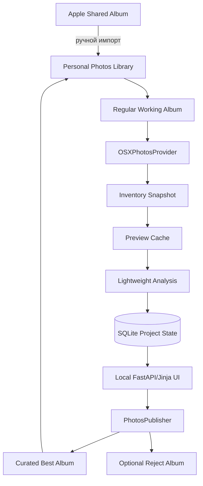

# Архитектура

## Context diagram



## Component boundaries

### `photos/`

Единственный слой, знающий об `osxphotos`, Photos Library paths и publish subprocesses.

### `pipeline/`

Оркестрация stages, jobs, batching, invalidation и resume. Не содержит web-specific кода.

### `analysis/`

Чистые функции Pillow/NumPy: metrics, hashes, similarity, normalization и decisions. Должен быть тестируемым без macOS и Photos.

### `db/`

SQLite migrations и repository. ORM не используется.

### `web/`

HTML/UI/API. Не обращается к `osxphotos` напрямую, только через services/coordinator.

## Data flow

1. Project фиксирует library и album snapshot.
2. Inventory сохраняет metadata и доступные render candidates.
3. PreviewBuilder создаёт normalized review/thumbnail JPEG.
4. TechnicalAnalyzer, SimilarityAnalyzer и локальный Apple Vision сохраняют metrics.
5. Duplicate stage строит connected components и leaders.
6. DecisionEngine создаёт auto decisions, не затрагивая manual overrides.
7. UI выполняет human review.
8. Publisher revalidates source и создаёт UUID file для Best или Reject.
9. Dry-run предшествует apply.

## Failure containment

- Ошибка asset не роняет stage.
- Ошибка stage не удаляет предыдущие результаты.
- Ошибка publish не меняет project decisions.
- Отсутствие publish capability оставляет рабочий read-only analyzer.

## Dependency rules

```text
web → services/coordinator → photos/pipeline/db
analysis → только Pillow/NumPy/stdlib
photos → osxphotos + subprocess wrapper
db → sqlite3
```

Запрещены обратные зависимости из core в web.

## Stage invalidation

| Изменение | Что пересчитывать |
|---|---|
| Decision thresholds | Decisions |
| Duplicate thresholds | Duplicate groups + decisions |
| Preview size/quality | Previews + весь downstream |
| Source render fingerprint | Конкретный asset + downstream |
| Manual override | Только final decision |
