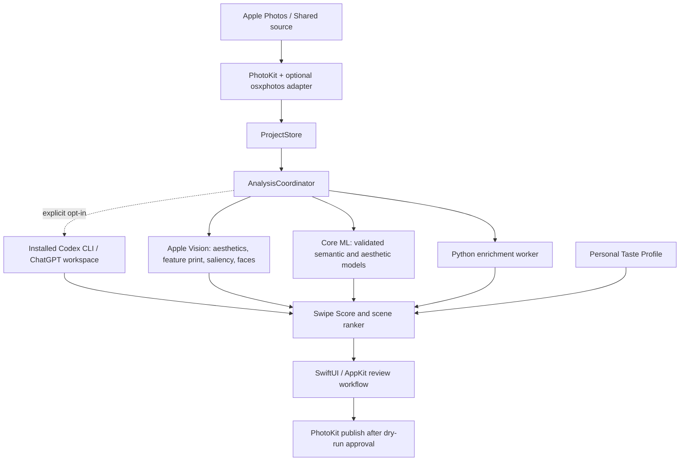

# Архитектура V2

## Target system

The released application is a signed native `.app`. It does not require HTML,
JavaScript, FastAPI, a browser or a localhost port.

## Component responsibilities

- **SwiftUI/AppKit** owns workflow, navigation, progress, review state and settings.
- **PhotoKit adapter** inventories supported regular albums and publishes the approved set.
- **osxphotos adapter** is optional and read-only for detailed Apple metadata or source
  capabilities that public APIs do not reliably expose.
- **ProjectStore** is the single writer for projects, assets, jobs, scores and decisions.
- **AnalysisCoordinator** schedules bounded stages, cancellation, resume and invalidation.
- **Vision engine** provides the mandatory generic native baseline on supported macOS.
- **Core ML engine** runs only versioned, benchmarked models with declared compute policy.
- **Python worker** is a temporary stateless enrichment boundary, never a second backend.
- **Taste Profile** owns versioned preference examples and lightweight ranking parameters.
- **Codex Vision adapter** is optional, cloud-backed and disabled by default. It auto-discovers
  the installed official CLI, requires ChatGPT authentication and emits schema-validated signals.

## State and IPC

Mutable state has one owner. During migration the bundled Python coordinator remains that
owner and the SwiftUI client exchanges correlated, versioned JSONL messages with it over
stdin/stdout. The transport exposes domain operations and opaque asset identifiers, never
arbitrary filesystem paths. Photos publication is still a separate plan → explicit approval
→ apply operation. When coordinator/storage move to Swift, Python enrichment workers become
stateless and lose database and publish capabilities.

Every analysis record includes:

- source render fingerprint;
- signal/model/schema versions;
- capability and unavailable reason;
- compute/runtime evidence where observable;
- timestamp and confidence.

A changed source fingerprint, feature schema or model version invalidates only dependent
results. Manual decisions and explicit pairwise labels survive re-analysis.

## Migration architecture

The former FastAPI/Jinja diagnostic UI has been removed. Product logic is implemented behind
the native worker contract; no HTTP compatibility surface remains.

Migration order:

1. native signal benchmark and versioned Swipe Score;
2. taste profile and evaluation harness;
3. native ProjectStore/coordinator boundary;
4. native workflow and gallery;
5. PhotoKit source/publish parity;
6. web stack removed after native parity.

Python removal is not a goal by itself. It is removed only when native engines reproduce all
validated signals without losing product quality.

## Safety boundaries

- no direct Photos database writes;
- no automatic deletion or source metadata mutation;
- Shared snapshots are service-owned renders, not claimed originals;
- publish is plan → revalidate → explicit approval → apply → audit;
- unsupported or failed assets remain reviewable;
- taste never overrides source-integrity, duplicate or resolution protection.
